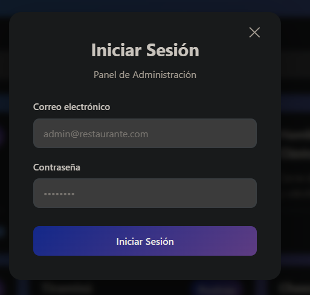
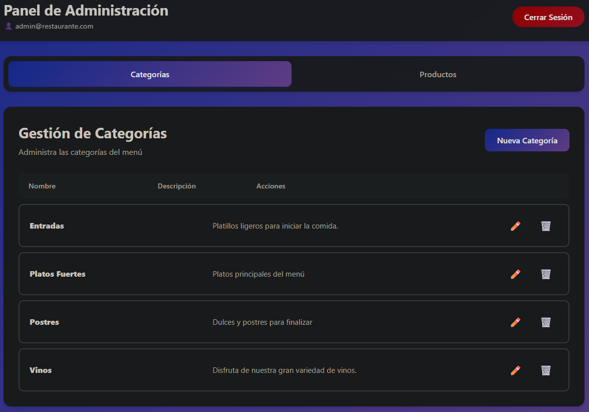
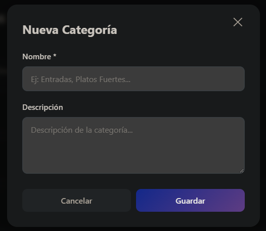
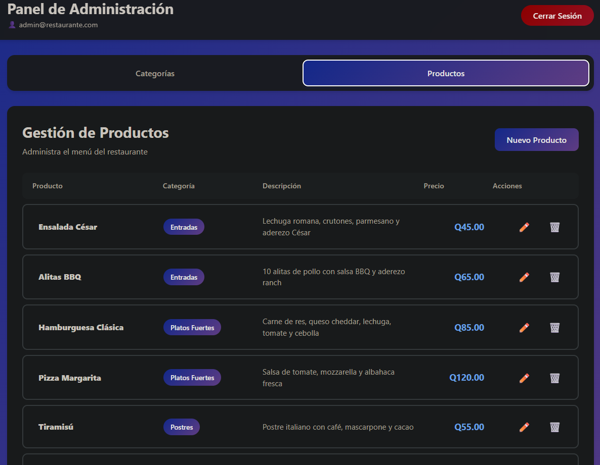
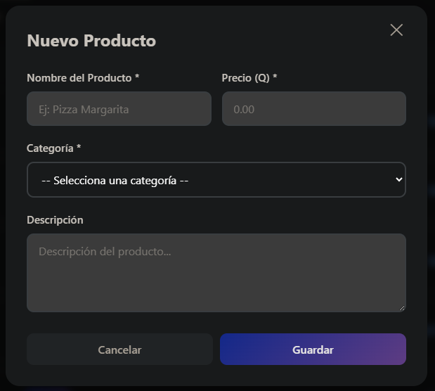

# Manual de Usuario - Sistema de Gestión de Restaurante

## Tabla de Contenidos
1. [Introducción](#introducción)
2. [Requisitos del Sistema](#requisitos-del-sistema)
3. [Acceso al Sistema](#acceso-al-sistema)
4. [Interfaz de Usuario Cliente](#interfaz-de-usuario-cliente)
5. [Panel de Administración](#panel-de-administración)
6. [Gestión de Categorías](#gestión-de-categorías)
7. [Gestión de Productos](#gestión-de-productos)
8. [Solución de Problemas](#solución-de-problemas)

---

## Introducción

Bienvenido al **Sistema de Gestión de Restaurante**, una aplicación web moderna desarrollada con arquitectura de microservicios que permite la visualización y administración del menú de un restaurante.

### Características Principales
- 📱 Interfaz responsiva y moderna
- 🔐 Sistema de autenticación seguro
- 📊 Gestión completa de productos y categorías
- 🔍 Búsqueda y filtrado de productos
- ⚡ Rendimiento optimizado con microservicios

---

## Requisitos del Sistema

### Para Usuarios Finales
- **Navegador Web moderno:**
  - Google Chrome 90+
  - Mozilla Firefox 88+
  - Microsoft Edge 90+
  - Safari 14+
- **Conexión a Internet estable**

### Para Administradores
- Credenciales de acceso administrativo
- Los mismos requisitos de navegador que usuarios finales

---

## Acceso al Sistema

### URL de Acceso
```
http://18.191.230.243:5173
```

### Credenciales de Administrador
```
Usuario: admin@restaurante.com
Contraseña: admin123
```

> ⚠️ **Nota de Seguridad:** Se recomienda cambiar la contraseña predeterminada después del primer acceso.

---

## Interfaz de Usuario Cliente

### Vista Principal del Menú

Al acceder al sistema, los usuarios pueden visualizar el menú completo del restaurante.


#### Componentes de la Interfaz

1. **Encabezado**
   - Título de la aplicación: "Práctica 2 AyD2 Microservicios"
   - Botón "Iniciar sesión" (esquina superior derecha)

2. **Sección de Filtros**
   - **Filtrar por categoría:** Dropdown para seleccionar categorías específicas
     - Opciones: Todas las categorías, Entradas, Platos Fuertes, Postres, Vinos
   - **Buscar producto:** Campo de texto para búsqueda por nombre

3. **Catálogo de Productos**
   - Visualización en tarjetas (cards) con:
     - Nombre del producto
     - Etiqueta de categoría (colored badge)
     - Descripción del producto
     - Precio (en Quetzales)

### Uso de Filtros

#### Filtrar por Categoría
1. Click en el dropdown "Filtrar por categoría"
2. Seleccionar la categoría deseada:
   - **Todas las categorías:** Muestra todos los productos
   - **Entradas:** Platillos ligeros para iniciar la comida
   - **Platos Fuertes:** Platos principales del menú
   - **Postres:** Dulces y postres para finalizar
   - **Vinos:** Gran variedad de vinos
3. Los productos se filtran automáticamente

#### Buscar Productos
1. Click en el campo "Buscar producto"
2. Escribir el nombre del producto (ej: "Pizza", "Hamburguesa")
3. La búsqueda se realiza en tiempo real
4. Los resultados se muestran mientras escribes

#### Combinar Filtros
- Puedes usar ambos filtros simultáneamente
- Ejemplo: Seleccionar "Postres" y buscar "Cheesecake"

---

## Panel de Administración

### Acceso al Panel

1. Click en el botón **"Iniciar sesión"** (esquina superior derecha)
2. Se abrirá un modal de inicio de sesión



3. Ingresar credenciales:
   - **Correo electrónico:** `admin@restaurante.com`
   - **Contraseña:** `admin123`
4. Click en **"Iniciar Sesión"**

### Navegación del Panel

El panel de administración contiene dos pestañas principales:

```
┌─────────────────────────────────────┐
│  Categorías  |  Productos           │
└─────────────────────────────────────┘
```

---

## Gestión de Categorías

### Visualizar Categorías

Al seleccionar la pestaña **"Categorías"**, verás:



- **Encabezado:** "Gestión de Categorías"
- **Subtítulo:** "Administra las categorías del menú"
- **Botón:** "Nueva Categoría" (esquina superior derecha)
- **Tabla de categorías** con columnas:
  - Nombre
  - Descripción
  - Acciones (Editar | Eliminar)

### Crear Nueva Categoría

1. Click en el botón **"Nueva Categoría"**
2. Se abrirá un modal con el formulario:




   ```
   ┌─────────────────────────────┐
   │  Nueva Categoría         ✕ │
   ├─────────────────────────────┤
   │  Nombre *                   │
   │  [Ej: Entradas, Platos...] │
   │                             │
   │  Descripción                │
   │  [Descripción de la        │
   │   categoría...]             │
   │                             │
   │  [Cancelar]  [Guardar]     │
   └─────────────────────────────┘
   ```

3. **Llenar los campos:**
   - **Nombre:** (Requerido) Nombre de la categoría
   - **Descripción:** (Opcional) Descripción detallada

4. Click en **"Guardar"**
5. Mensaje de confirmación: "Categoría creada exitosamente"

### Editar Categoría

1. Localizar la categoría en la lista
2. Click en el ícono de **editar** (lápiz 📝)
3. El modal se abrirá con los datos actuales
4. Modificar los campos necesarios
5. Click en **"Guardar"**
6. Mensaje de confirmación: "Categoría actualizada exitosamente"

### Eliminar Categoría

1. Localizar la categoría en la lista
2. Click en el ícono de **eliminar** (papelera 🗑️)
3. Aparecerá un mensaje de confirmación
4. Confirmar la eliminación
5. Mensaje: "Categoría eliminada exitosamente"

> ⚠️ **Advertencia:** No se puede eliminar una categoría que tenga productos asociados.

---

## Gestión de Productos

### Visualizar Productos

Al seleccionar la pestaña **"Productos"**, verás:




- **Encabezado:** "Gestión de Productos"
- **Subtítulo:** "Administra el menú del restaurante"
- **Botón:** "Nuevo Producto" (esquina superior derecha)
- **Tabla de productos** con columnas:
  - Producto
  - Categoría
  - Descripción
  - Precio
  - Acciones (Editar | Eliminar)

### Crear Nuevo Producto

1. Click en el botón **"Nuevo Producto"**
2. Se abrirá un modal con el formulario:



   ```
   ┌─────────────────────────────────────┐
   │  Nuevo Producto                  ✕ │
   ├─────────────────────────────────────┤
   │  Nombre del Producto *              │
   │  [Ej: Pizza Margarita]              │
   │                                     │
   │  Precio (Q) *                       │
   │  [0.00]                             │
   │                                     │
   │  Categoría *                        │
   │  [-- Selecciona una categoría --]▼ │
   │                                     │
   │  Descripción                        │
   │  [Descripción del producto...]     │
   │                                     │
   │  [Cancelar]  [Guardar]             │
   └─────────────────────────────────────┘
   ```

3. **Llenar los campos:**
   - **Nombre del Producto:** (Requerido) Nombre del platillo
   - **Precio (Q):** (Requerido) Precio en Quetzales (formato: 0.00)
   - **Categoría:** (Requerido) Seleccionar de la lista desplegable
   - **Descripción:** (Opcional) Descripción detallada del producto

4. Click en **"Guardar"**
5. Mensaje de confirmación: "Producto creado exitosamente"

### Editar Producto

1. Localizar el producto en la lista
2. Click en el ícono de **editar** (lápiz 📝)
3. El modal se abrirá con los datos actuales
4. Modificar los campos necesarios
5. Click en **"Guardar"**
6. Mensaje de confirmación: "Producto actualizado exitosamente"

### Eliminar Producto

1. Localizar el producto en la lista
2. Click en el ícono de **eliminar** (papelera 🗑️)
3. Aparecerá un mensaje de confirmación:
   ```
   ¿Está seguro que desea eliminar este producto?
   [Cancelar]  [Eliminar]
   ```
4. Confirmar la eliminación
5. Mensaje: "Producto eliminado exitosamente"

### Cerrar Sesión

Para salir del panel de administración:

1. Click en el botón **"Cerrar Sesión"** (esquina superior derecha)
2. Serás redirigido a la vista pública del menú

---

## Solución de Problemas

### No puedo iniciar sesión

**Problema:** El sistema no acepta mis credenciales

**Soluciones:**
1. Verificar que las credenciales sean correctas:
   - Usuario: `admin@restaurante.com`
   - Contraseña: `admin123`
2. Verificar que no haya espacios extra
3. Asegurarse de que CAPS LOCK esté desactivado
4. Limpiar caché del navegador
5. Intentar en modo incógnito/privado

### Los productos no se cargan

**Problema:** La página está en blanco o muestra un error

**Soluciones:**
1. Verificar conexión a Internet
2. Actualizar la página (F5 o Ctrl+R)
3. Limpiar caché del navegador:
   - Chrome: Ctrl+Shift+Del
   - Firefox: Ctrl+Shift+Del
4. Verificar que la URL sea correcta: `http://18.191.230.243:5173`
5. Contactar al administrador del sistema

### Error al crear/editar producto o categoría

**Problema:** Mensaje de error al guardar cambios

**Soluciones:**
1. Verificar que todos los campos requeridos (*) estén llenos
2. Verificar formato del precio (usar punto como decimal: 45.00)
3. Asegurarse de que el nombre no esté duplicado
4. Verificar conexión a Internet
5. Intentar cerrar y volver a abrir el modal
6. Si persiste, refrescar la página e intentar nuevamente

### Los filtros no funcionan

**Problema:** Al filtrar, no se muestran los resultados esperados

**Soluciones:**
1. Limpiar el campo de búsqueda antes de usar el filtro de categoría
2. Refrescar la página
3. Verificar que existan productos en esa categoría
4. Probar con otra categoría o término de búsqueda

### La página se ve desconfigurada

**Problema:** Los elementos están fuera de lugar

**Soluciones:**
1. Actualizar a la última versión del navegador
2. Limpiar caché del navegador
3. Intentar con otro navegador
4. Verificar el zoom del navegador (debe estar al 100%)

### Problemas de rendimiento

**Problema:** La aplicación responde lentamente

**Soluciones:**
1. Verificar velocidad de conexión a Internet
2. Cerrar otras pestañas del navegador
3. Limpiar caché y cookies
4. Reiniciar el navegador
5. Verificar que no haya descargas en segundo plano

---

## Contacto y Soporte

Para reportar problemas o solicitar ayuda adicional:

- **Equipo de Desarrollo:** Grupo 10 - AyD2
- **Email:** soporte@restaurante.com
- **Horario de Soporte:** Lunes a Viernes, 8:00 AM - 5:00 PM

---

## Glosario

- **Microservicio:** Arquitectura de software donde la aplicación se divide en servicios independientes
- **API REST:** Interfaz de programación para comunicación entre servicios
- **Modal:** Ventana emergente sobre la interfaz principal
- **Dropdown:** Lista desplegable de opciones
- **Badge:** Etiqueta visual que identifica la categoría

---

## Historial de Versiones

| Versión | Fecha | Cambios |
|---------|-------|---------|
| 1.0 | 24/10/2024 | Versión inicial del sistema |

---

**Fin del Manual de Usuario**

---

*© 2024 Grupo 10 - Análisis y Diseño de Sistemas 2 - USAC*